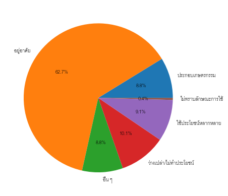
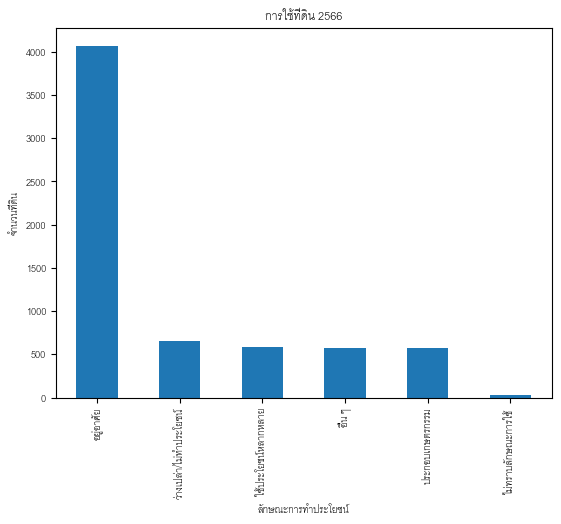
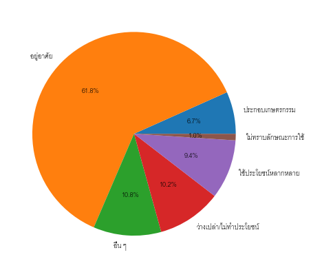
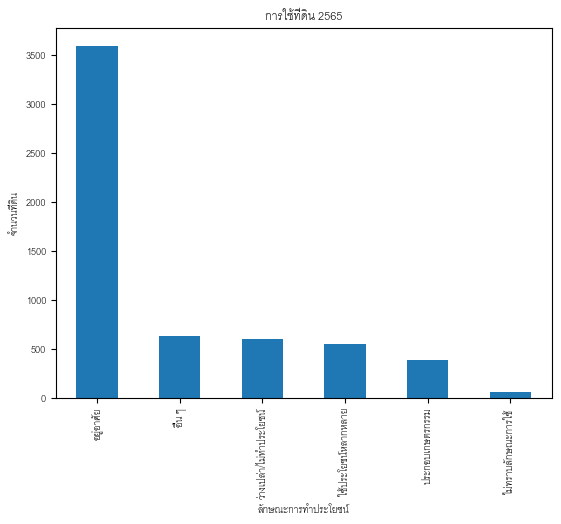
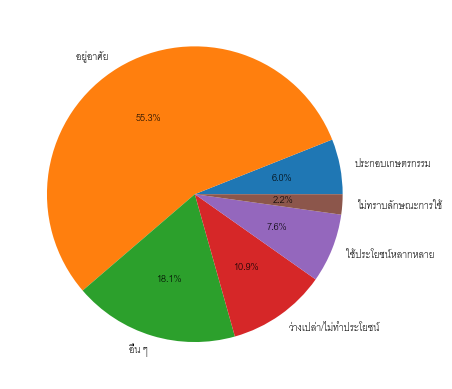
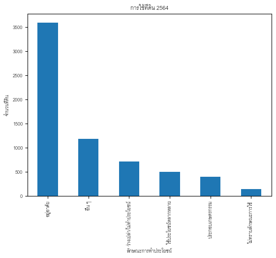
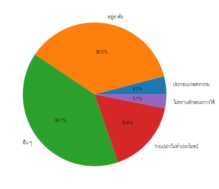
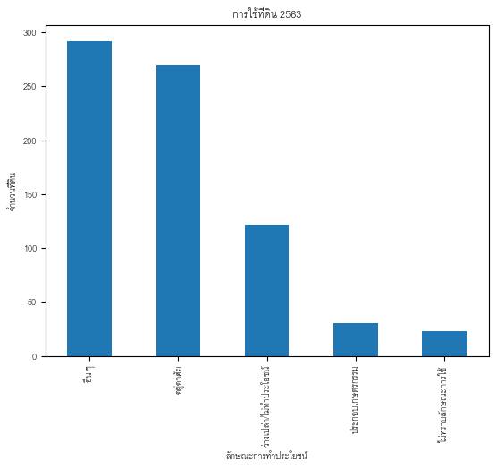

# Land Usage Analysis Project

This project aims to analyze how land usage changes year by year for a province in Thailand over a period of four years. The goal is to gain insights into the evolving patterns of land usage and identify any significant trends or shifts.

## Dataset

The dataset used for this analysis consists of land usage data collected annually for the selected province. It includes information such as land area, land type, and the year of observation. The dataset can be found in the `dataset` directory of this repository.

## Collaborators

- [OteEnded](https://github.com/OteEnded) [Project Lead - Data cleaning, Data visualization]
- [xMickeys](https://github.com/xMickeyS) [Data scientist - Data analysis, Data visualization]
- [Wr3nch_ren](https://github.com/Wr3nch-ren) [Data cleaning]

## Contact

For any questions or inquiries, please contact ratnaritjumnong@gmail.com.

---

# รายงานผลรายการที่ดินเทศบาลเมืองลำพูน จังหวัดลำพูน

รายงานฉบับนี้จัดทำขึ้นเพื่ออธิบายลักษณะการทำประโยชน์ของที่ดินในเทศบาลเมืองลำพูนในระยะเวลา 4 ปี ตั้งแต่ปีพุทธศักราช 2563 ถึง 2566 โดยมุ่งเน้นไปที่ลักษณะการทำประโยชน์ประกอบเกษตรกรรม และผู้จัดทำได้ศึกษาจากแบบบัญชีรายการที่ดินและสิ่งปลูกสร้างเทศบาลเมืองลำพูนผ่านเครื่องมือใช้เขียนโปรแกรมสำหรับงานวิทยาศาสตร์ข้อมูลอย่าง Jupyter Notebook

**จำแนกลักษณะการทำประโยชน์**

ตารางที่ 1 : ตารางแสดงจำนวนที่ดินที่ใช้ในลักษณะการทำประโยชน์ต่าง ๆ

| ปี (พ.ศ.) | จำนวนที่ดิน | ลักษณะการทำประโยชน์ (ที่) |
| --- | --- | --- |
| ประกอบเกษตรกรรม | อยู่อาศัย | อื่น ๆ | ว่างเปล่า/ไม่ทำประโยชน์ | ใช้ประโยชน์หลากหลาย | ไม่ระบุ |
| 2566 | 6490 | 569 | 4072 | 574 | 658 | 588 | 29 |
| 2565 | 5818 | 389 | 3598 | 627 | 596 | 548 | 0 |
| 2564 | 6506 | 392 | 3596 | 1176 | 706 | 492 | 144 |
| 2563 | 736 | 30 | 269 | 292 | 122 | 0 | 23 |

ตารางที่ 2 : ตารางแสดงเปอร์เซ็นที่ดินที่ใช้ลักษณะการทำประโยชน์ต่าง ๆ จากจำนวนที่ดินทั้งหมด

| ปี (พ.ศ.) | จำนวนที่ดิน | ลักษณะการทำประโยชน์ (%) |
| --- | --- | --- |
| ประกอบเกษตรกรรม | อยู่อาศัย | อื่น ๆ | ว่างเปล่า/ไม่ทำประโยชน์ | ใช้ประโยชน์หลากหลาย | ไม่ระบุ |
| 2566 | 6490 | 8.7673 | 62.7427 | 8.8444 | 10.1387 | 9.0601 | 0.4468 |
| 2565 | 5818 | 6.6861 | 61.842 | 10.7769 | 10.2441 | 9.4191 | 0.0 |
| 2564 | 6506 | 6.0252 | 55.2720 | 18.0756 | 10.8515 | 7.5623 | 2.2133 |
| 2563 | 736 | 4.0761 | 36.5489 | 39.6739 | 16.5760 | 0.0 | 3.125 |

ตารางแสดงถึงในแต่ละปีมีจำนวนที่ดินซึ่งอยู่ในรายงานผลที่ดินเทศบาลเมืองลำพูนกี่พื้นที่ และมีลักษณะการทำประโยชน์กี่พื้นที่ คิดเป็นกี่เปอร์เซ็นจากจำนวนที่ดินทั้งหมด โดยจำแนกออกเป็นลักษณะการใช้ประโยชน์ประกอบเกษตรกรรม อยู่อาศัย อื่น ๆ ว่างเปล่า/ไม่ทำประโยชน์ ใช้ประโยชน์หลากหลาย และไม่ระบุ

สามารถดูรายการที่ดินที่ประกอบการเกษตรกรรมแต่ละปีได้ที่แฟ้ม พื้นที่ประกอบเกษตรกรรม

ตารางที่ 3 : กราฟแสดงเปอร์เซ็น และจำนวนการใช้ที่ดินในลักษณะการทำประโยชน์ต่าง ๆ

| 2566 | |
| --- | --- |
|  |  |
| 2565 | |
|  |  |
| 2564 | |
|  |  |
| 2563 | |
|  |  |

จากกราฟดังกล่าวที่ดินส่วนใหญ่ในเทศบาลเมืองลำพูน จังหวัดลำพูนใช้เพื่ออยู่อาศัยเป็นส่วนมาก นอกจากนี้ใช้เพื่อการเกษตรกรรมและอื่น ๆ เป็นส่วนมากในระยะเวลา 4 ปี

ตารางที่ 4 : ตารางแสดงจำนวนที่ดินประเภทที่ดินต่าง ๆ

| ปี (พ.ศ.) | ประเภทที่ดิน (ที่) |
| --- | --- |
|
| โฉนด | ที่ราชพัสดุ | น.ส.3 | น.ส.ล | อื่น ๆ | ไม่ระบุ |
| 2566 | 6381 | 13 | 13 | 4 | - | 79 |
| 2565 | 5779 | 9 | 15 | 2 | 2 | 11 |
| 2564 | 6382 | 13 | 13 | 6 | 0 | 92 |
| 2563 | 735 | - | - | 1 | 0 | - |

ตารางที่ 5 : ตารางแสดงจำนวนที่ดินที่ใช้ประกอบเกษตรกรรมในประเภทที่ดินต่าง ๆ

| ปี (พ.ศ.) | ประเภทที่ดิน (ที่) |
| --- | --- |
|
| โฉนด | ที่ราชพัสดุ | น.ส.3 | น.ส.ล | อื่น ๆ | ไม่ระบุ |
| 2566 | 567 | - | -- | 2 | - | - |
| 2565 | 389 | - | - | - | - | - |
| 2564 | 392 | - | - | - | - | - |
| 2563 | 30 | - | - | - | - | - |

ประเภทที่ดินของเทศบาลเมืองลำพูนประกอบด้วย โฉนด, ที่ราชพัสดุ, น.ส.3, น.ส.3., อื่น ๆ และ ไม่ระบุ โดยที่ดินส่วนมากเป็นประเภทโฉนด และพื้นที่เกษตรกรรมใช้ที่ดินประเภทโฉนดเช่นเดียวกัน

**เปรียบเทียบลักษณะการทำประโยชน์**

ตารางที่ 6 : ตารางแสดงจำนวนและเปอร์เซ็นของพื้นที่เกษตรกรรมจากพื้นที่ว่างเปล่า

| ระหว่างปี | พื้นที่เกษตรกรรมจากพื้นที่ไม่ทำประโยชน์ |
| --- | --- |
| จำนวน (ที่) | เปอร์เซ็น (%) |
| 2565 - 2566 | 72 | 14.9373 |
| 2554 - 2565 | 63 | 10.5528 |
| 2553 - 2564 | 14 | 11.5702 |
| ความเปลี่ยนทั้งหมด (4 ปี) | 149 |
|

ตารางที่ 7 : ตารางแสดงจำนวนพื้นที่เกษตรกรรมจากพื้นที่ว่างเปล่า เปรียบเทียบกับพื้นที่เกษตรทั้งหมด

| ปี | พื้นที่เกษตรกรรมทั้งหมด | พื้นที่เกษตรกรรมจากพื้นที่ไม่ทำประโยชน์ |
| --- | --- | --- |
| 2566 | 569 | 72 |
| 2565 | 389 | 63 |
| 2564 | 392 | 14 |

## รายงานผล

จากการเปรียบเทียบพบว่าในปี 2565 มีพื้นที่ว่างเปล่า หรือไม่ทำประโยชน์ 482 พื้นที่ โดยนับเฉพาะพื้นที่ซึ่งในปี 2566 มีรหัสที่ดินเดียวกัน (เดิมมีพื้นที่ว่างเปล่า หรือไม่ทำประโยชน์ 596 พื้นที่) จึงได้ว่าปี 2566 จากพื้นที่ว่างเปล่า หรือไม่ทำประโยชน์ของปี 2565 ได้เปลี่ยนเป็นพื้นที่ทำเกษตรกรรมถึง 72 ที่ดิน หรือคิดเป็น 14.9373% ของพื้นที่ว่างเปล่า หรือไม่ทำประโยชน์ทั้งหมด และคิดเป็น 12 .6537% ของพื้นที่เกษตรกรรมทั้งหมดในปี 2566 สามารถดูข้อมูลทั้ง 72 พื้นที่ได้ที่ไฟล์ [พื้นที่ประกอบเกษตรกรรมจากพื้นที่ไม่ทำประโยชน์\_2566](result/พื้นที่ประกอบเกษตรกรรมจากพื้นที่ไม่ทำประโยชน์/2565_2566/พื้นที่ประกอบเกษตรกรรมจากพื้นที่ไม่ทำประโยชน์_2566.csv)

นอกจากนั้นในปี 2564 มีพื้นที่ว่างเปล่า หรือไม่ทำประโยชน์ 597 พื้นที่ โดยนับเฉพาะพื้นที่ซึ่งในปี 2565 มีรหัสที่ดินเดียวกัน (เดิมมีพื้นที่ว่างเปล่า หรือไม่ทำประโยชน์ 706 พื้นที่) จึงได้ว่าปี 2565 จากพื้นที่ว่างเปล่า หรือไม่ทำประโยชน์ของปี 2564 ได้เปลี่ยนเป็นพื้นที่ทำเกษตรกรรมถึง 63 พื้นที่ หรือคิดเป็น 10.5528% ของพื้นที่ว่างเปล่าทั้งหมด หรือไม่ทำประโยชน์ทั้งหมด และคิดเป็น 16 .1954% ของพื้นที่เกษตรกรรมทั้งหมดในปี 2565 สามารถดูข้อมูลทั้ง 63 พื้นที่ได้ที่ไฟล์ [พื้นที่ประกอบเกษตรกรรมจากพื้นที่ไม่ทำประโยชน์\_2565](result/พื้นที่ประกอบเกษตรกรรมจากพื้นที่ไม่ทำประโยชน์/2564_2565/พื้นที่ประกอบเกษตรกรรมจากพื้นที่ไม่ทำประโยชน์_2565.csv)

และสุดท้ายในปี 2563 พื้นที่ว่างเปล่า หรือไม่ทำประโยชน์ 121 พื้นที่ โดยนับเฉพาะพื้นที่ซึ่งในปี 2564 มีรหัสที่ดินเดียวกัน (เดิมมีพื้นที่ว่างเปล่า หรือไม่ทำประโยชน์ 122 พื้นที่) จึงได้ว่าปี 2564 จากพื้นที่ว่างเปล่า หรือไม่ทำประโยชน์ของปี 2563 ได้เปลี่ยนเป็นพื้นที่ทำเกษตรกรรมถึง 14 พื้นที่ หรือคิดเป็น 11.5702% ของพื้นที่ว่างเปล่าทั้งหมด และคิดเป็นเพียง 0.0004 ของพื้นที่เกษตรกรรมทั้งหมดในปี 2564 สามารถดูข้อมูลทั้ง 14 พื้นที่ได้ที่ไฟล์ [พื้นที่ประกอบเกษตรกรรมจากพื้นที่ไม่ทำประโยชน์\_2564](result/พื้นที่ประกอบเกษตรกรรมจากพื้นที่ไม่ทำประโยชน์/2563_2564/พื้นที่ประกอบเกษตรกรรมจากพื้นที่ไม่ทำประโยชน์_2564.csv)

---

*Past of this README.md file is generated by an AI (GitHub Copilot).*
